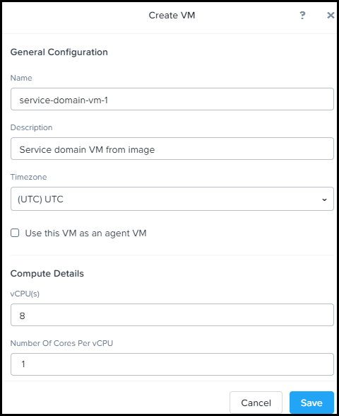
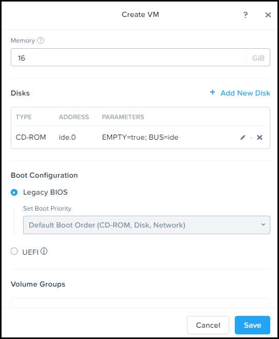
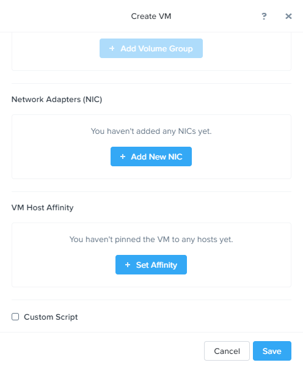

Deploy a Service Domain and add it to Karbon Platform Services (KPS)
====================================================================

KPS is a Kubernetes based multi-cloud PaaS that enables rapid
development and deployment of microservices-based applications ranging
from simple stateful containerized applications to complex AI, IoT and
hybrid applications across any cloud.

This tutorial will guide you through the deployment of a single node KPS
Service Domain on a Nutanix cluster, power it on and register it with
the KPS Cloud Management Portal (CMP).

After creating the Service Domain VM, note the VM IP address and ID in
the VM Details panel. You will need this information to add your Service
Domain in the Karbon Platform Services management console Service
Domains page.

--------------

Creating and deploying a KPS Service Domain
-------------------------------------------
|
1. Log on as an administrator to your cluster's web console through the
   Chrome web browser.
2. Click Home > VM, then click Create VM.

|

   
   **Figure. Create VM Dialog Box 1**
|    

   **Figure. Create VM Dialog Box 2**
|

   
   **Figure. Create VM Dialog Box 3**
|
The 'Create VM' dialog box appears. You might need to scroll down to see
everything that is displayed here.

3. Do the following in the indicated fields.
You might require more memory and storage as determined by your applications.
|
#. Name: Enter a name for the VM.
   * Description (optional): Enter a description for the VM.
   * Use this VM as an agent VM: Do not select. Not used in this case.
   * vCPU(s): Enter the number of virtual CPUs to allocate to this VM. For Karbon Platform Services, enter 8.
   * Number of Cores per vCPU: Enter the number of cores assigned to each virtual CPU. For Karbon Platform Services, enter 1.
   * Memory: Enter the amount of memory (in GiBs) to allocate to this VM. For Karbon Platform Services, enter 16.

This tutorial will guide you through the deployment and update of a
sample Kubernetes Application using KPS. The application is deployed to
a KPS Service Domain for execution. This tutorial assumes your Service
Domain has already been deployed using steps from the Karbon Platform
Services Admin Guide and that direct network connectivity between the
Service Domain and your workstation is configured (to view sample web
app output). Access to the Admin Guide is provided via the My Nutanix
Portal and requires an account to login.

**For brevity, several component applications in this tutorial have been
combined into single deployment manifests (Kubernetes YAML or Helm
chart). This is not representative of a typical production deployment,
where all applications and services are deployed as separate apps using
API calls in a standard CI/CD pipeline.**

Accessing Karbon Platform Services
----------------------------------

1. Open https://my.nutanix.com/ in your browser. If you don't already
   have a My Nutanix account, follow steps to create one.
2. Scroll to the Cloud Services section and click Launch to access the
   Karbon Platform Services Cloud Management Console.

At this point you should have a dashboard with a default User (you),
Project, Category.

Application Design
------------------

The application deployed as part of this tutorial is a typical content
management system where users can post blogs, articles and others can
add comments to it. You will also add analytics like a wordcloud to tell
authors the most popular terms in the reviews for their posts.

Here are the components used to build the application:

-  Wordpress as the content management engine for creating the
   e-commerce application
-  MySQL database to support Wordpress
-  Debezium for getting change events from DB to Kafka
-  Kafka for streaming the orders other services like Recommendation
   Service
-  Recommendation Service receives the streams and updates the most
   bought product listing page
-  Loader which will simulate user behavior with artificially created
   data about products and pruchase history

Application Architecture
------------------------

.. figure:: img/woodkraft-app.png
   :alt: Woodkraft App

   Woodkraft App!
Application Deployment
----------------------

The following steps will explain how to deploy the Woodkraft application
on KPS.

Creating a Project
~~~~~~~~~~~~~~~~~~

In KPS, Projects are used to segment resources such as Kubernetes Apps
and other services so that only assigned users can view and modify them.
This allows different departments or teams to utilize shared Service
Domains, or cloud resources without interfering with each other's
applications or business logic.

As part of this tutorial, you’ll create a new Project to deploy your
sample Application.

1. After logging into the Karbon Platform Services Cloud Management
   Console, proceed to the Projects section.
2. Create a project, name it Woodkraft Application, add yourself as a
   User, and then click **Next**.

.. figure:: img/app-setup.png
   :alt: App Setup

   App Setup!

1. On the Resources Assignment dialog, select the Service Domain you
   wish to run your application and click **Next**.

KPS has the ability to natively send to several public cloud services
such as AWS S3, or GCP Cloud Datastore. For this tutorial, Cloud Profile
Selection can be left blank because no cloud resources will be used.

KPS can run Kubernetes Apps with images stored in public or private
registries. Private registries can be accessed by creating a KPS
Container Registry Profile to store required access information. Because
this tutorial utilizes containers hosted in a public registry, Container
Registry Selection can be left blank.

1. In the final section, enable **Kafka**, **Prometheus**, **Traefik**,
   and **Istio** services and click **Create**.

Application Helm Chart
~~~~~~~~~~~~~~~~~~~~~~

In this section, you will be uploading a Helm chart that will deploy
microservices necessary for the application such as Wordpress, Debezium,
Prometheus, and MySQL. Prometheus will be used for event monitoring and
alerting for the application. The purpose of the other apps are
described above.

1. In a new browser tab or window, download the compressed tar file
   labeled woodkraft-apps. This file contains Helm charts for deploying
   the first set of Kubernetes Apps.
2. Switch context to Woodkraft Application in the Project pulldown, then
   click **Kubernetes Apps**.
3. Create a new Kubernetes App and name it **woodkraft-apps**. In the
   Service Domain Selection section, be sure to choose the same Service
   Domain you selected for the project, then click **Next**.

.. figure:: img/helm-chart1.png
   :alt: Helm Chart1

   Helm Chart1!

1. On the Configuration dialog, upload the woodkraft-apps tar file
   downloaded earlier as a Helm chart. Select **Show YAML** for a look
   at the sample configurations, then click **Create**. This Helm chart
   will deploy major app services such as Wordpress, Debezium,
   Prometheus, and MySQL.

Verify Istio, Kafka and Traefik configurations
^^^^^^^^^^^^^^^^^^^^^^^^^^^^^^^^^^^^^^^^^^^^^^

1. Browse to the Istio section in the UI and confirm new Application
   Metrics for woodkraft-apps are now present.

.. figure:: img/init-istio-config.png
   :alt: Application Metrics

   Init-Istio!

1. Browse to the Kafka section in the UI and confrim new wordpress\_db
   topics have been created.

.. figure:: img/kafka-topics.png
   :alt: Kafka Topics

   kafka-topics!

1. Browse to the Traefik section in the UI to confirm new ingress rules
   for woodkraft-apps were created.

.. figure:: img/init-traefik.png
   :alt: Traefik Rules

   Traefik2!
Monitor Helm Chart
~~~~~~~~~~~~~~~~~~

Uploading the next Helm chart will deploy monitoring services such as
Grafana and will make edits to the Traefik Rules. Grafana provides
charts, graphs, and alerts for the web when connected to supported data
sources. It is expandable through a plug-in system. End users can create
complex monitoring dashboards using interactive query builders. Traefik
ingress allows for content-based routing, load balancing, and SSL/TLS
termination.

1. Download the compressed tar file labeled woodkraft-monitoring.

   -  This file contains Helm charts for deploying the Kubernetes Apps
      for monitoring the core apps deployed above.

2. Once again, click **Kubernetes Apps** in context of the Woodkraft
   Application project.
3. Create a new Kubernetes App and name it **woodkraft-monitoring**.
4. Choose the same service domain you selected for the project, then
   click **Next**.
5. On the Configuration dialog, upload the monitoring tar file as a Helm
   chart, and click **Create**.

   -  This Helm chart will deploy a new Grafana app on the Service
      Domain.

6. Browse to the Traefik section in the UI to confirm new ingress rule
   for Grafana was created.

.. figure:: img/traefik-rules.png
   :alt: new rule

   Traefik!
The application has now been deployed and should be running successfully
on your Service Domain.

Accessing the Applications
~~~~~~~~~~~~~~~~~~~~~~~~~~

1. Create two new DNS records that map the hostnames and IP addresses
   used in the **woodkraft.karbon.nutanix.com** and
   **grafana.woodkraft.karbon.nutanix.com** Traefik rules created above.
   For simplicity, on your local workstation, add the hostnames to the
   **/etc/hosts** file.

MacOS/Linux
^^^^^^^^^^^

::

    echo "<Service Domain IP> woodkraft.karbon.nutanix.com" | sudo tee -a /etc/hosts
    echo "<Service Domain IP> grafana.woodkraft.karbon.nutanix.com" | sudo tee -a /etc/hosts

Windows
^^^^^^^

::

    echo <Service Domain IP> woodkraft.karbon.nutanix.com >> %WINDIR%\System32\Drivers\Etc\Hosts
    echo <Service Domain IP> grafana.woodkraft.karbon.nutanix.com >> %WINDIR%\System32\Drivers\Etc\Hosts

WordPress
^^^^^^^^^

Visit
`woodkraft.karbon.nutanix.com <https://woodkraft.karbon.nutanix.com/>`__
and confirm that the application is working successfully.

.. figure:: img/app.png
   :alt: web page

   App Web Page
Grafana
^^^^^^^

1. Visit
   `grafana.woodkraft.karbon.nutanix.com <https://grafana.woodkraft.karbon.nutanix.com/>`__.
2. Enter *admin* for both the username and password.
3. Enter the password of your choosing.

   -  This will be the password for future logins with the *admin*
      username

4. View the Grafana dashboard linked to the Woodkraft application.

.. figure:: img/grafana.png
   :alt: grafana

   Grafana
Smart Update Helm Chart
~~~~~~~~~~~~~~~~~~~~~~~

The final Helm chart will push updates to the already deployed
application. The update deploys an additinal recommendation service and
modifies the Istio Virtual Service configuration for the recommendation
service currently running in the app. Connections from Firefox browsers
will now be directed to recommendation service v2. In KPS, Istio
provides traffic management, secure connection, policy enforcement, and
telemetry collection.

1. Download the compressed tar file labeled woodkraft-smart-update.
2. Once again, click **Kubernetes Apps** in context of the Woodkraft
   Application project.
3. Create a new Kubernetes app and name it **woodkraft-updates**. Again,
   be sure to choose the same service domain you selected for the
   project, then click **Next**.
4. On the Configuration dialog, upload the smart-update tar file as a
   Helm chart, and click **Create**.

   -  This Helm chart will update the recommendation service running in
      the application.

5. Browse to the Istio, Virtual Services section in the UI and confirm
   and confirm there are two recommendation services running.

   -  Notice the regex labeled *Firefox*

6. Open
   `woodkraft.karbon.nutanix.com <https://woodkraft.karbon.nutanix.com/recommendations>`__
   in Firefox and view the updated recommendation service.

.. figure:: img/rs2.png
   :alt: rs2

   RS2!
Congratulations! You've successfully deployed a Kubernetes App to your
Service Domain, and then updated it, using Karbon Platform Services. KPS
makes it simple to manage the deployment and monitoring of both Service
Domains as well as the services, applications, and data residing on
them.

Takeaways
---------

-  Creating projects with Karbon Platform Services segments resources
   such as Kubernetes Apps and other services so that only assigned
   users can view and modify them.
-  KSP enables management of application services such as Kafka,
   Prometheus, Istio, and Traefik from one platform.
-  Kubernetes applications can be created using Kubernets formatted YAML
   or Helm charts in KPS.
-  Configuring and confirming ingress rules to deployed Kubernetes
   applications is easy in KPS.
-  KPS allows deployment of containerized applications and services at
   scale using a cloud-based SaaS control plane.

